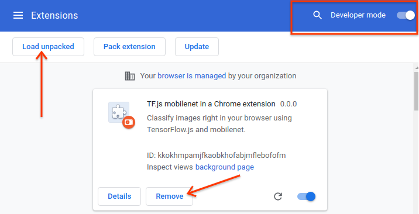
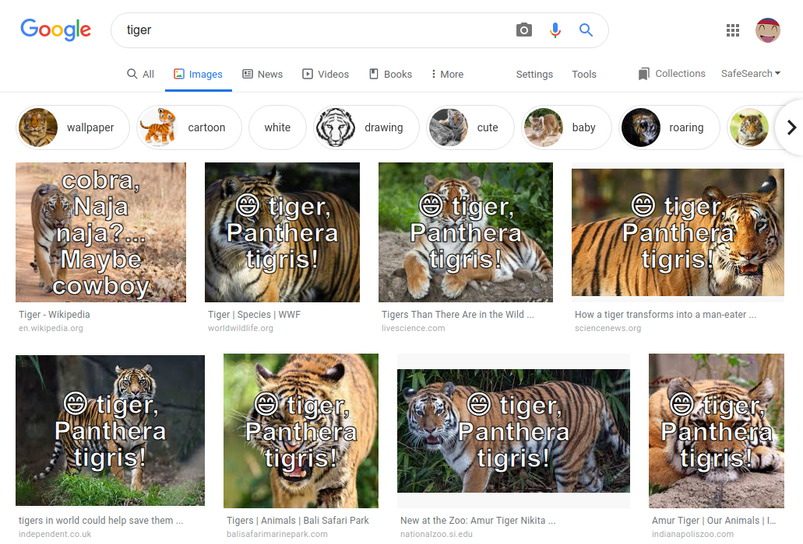

# TensorFlow.js 예제 : 브라우저 확장 프로그램

이 예제는 크롬 확장 프로그램을 만듭니다.
웹 페이지 안의 이미지에서 오른쪽 클릭을 하면 해당 이미지를 사용해 객체 탐지를 수행합니다.
이 확장 프로그램은 이미지에 MobileNetV2 분류기를 수행하고 예측한 클래스를 이미지 위에 출력합니다.

다음 명령으로 확장 프로그램을 만듭니다:

```sh
yarn
yarn build
```

크롬에 압축 해제된 확장 프로그램을 설치하려면 이 [안내](https://developer.chrome.com/extensions/getstarted)를 따르세요.
요약하면 `chrome://extensions`에 접속하여 오른쪽 위에 있는 `개발자 모드`를 킨 다음 `압축해제된 확장 프로그램을 로드합니다`를 클릭합니다.
그다음 `manifest.json` 파일이 있는 `dist` 디렉토리를 선택합니다.

설치가 되면 `TF.js mobilenet` 크롬 확장 프로그램 아이콘이 나타납니다.




확장 프로그램 사용법
----
확장 프로그램이 설치되면 브라우저에서 이미지를 분류할 수 있습니다. 이미지가 포함된 사이트로 이동해 보세요. 예를 들어 구글 이미지 검색 페이지에서 tiger를 검색해 보세요. 그다음 분류하려는 이미지 위에서 마우스 오른쪽 버튼을 클릭합니다. 팝업 메뉴에서 “Classify Image with TensorFlow.js”라는 메뉴를 볼 수 있을 것입니다. 이 메뉴를 클릭하면 이 확장 프로그램이 지정한 이미지에 대해 MobileNet 모델을 실행하여 이미지 위에 예측 결과를 나타내는 텍스트를 추가해 줍니다




확장 프로그램 삭제하기
----
확장 프로그램을 삭제하려면 확장 프로그램 페이지에 있는 “삭제" 버튼을 클릭하세요(그림 12.4 참조). 또는 브라우저 오른쪽 위에 있는 확장 프로그램 아이콘을 오른쪽 클릭하여 “Chrome에서 삭제…” 메뉴를 클릭합니다.
