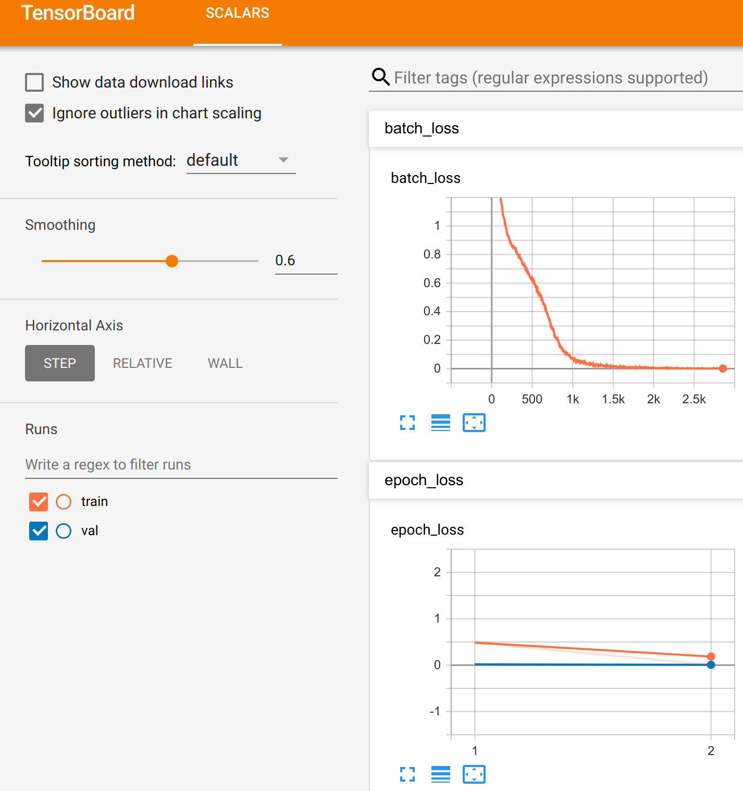

# TensorFlow.js 예제: LSTM-어텐션 모델을 사용한 날짜 변환

[라이브 예제를 온라인에서 볼 수 있습니다!](https://ml-ko.kr/tfjs/date-conversion-attention)

## 개요

이 예는 여러 가지 날짜 포맷(예를 들어, 01/18/2019, 18JAN2019, 18-01-2019)을
ISO 날짜 포맷(즉, 2019-01-18)으로 바꾸기 위해 TensorFlow.js를 사용해
LSTM과 어텐션 메커니즘 기반의 모델을 훈련하는 방법을 보입니다.

이 에에서는 데이터 엔지니어링, 서버측 모델 훈련, 클라이언트측 추론, 모델 시각화 등을 포함한
전체 머신 러닝 워크플로를 보여 줍니다.

훈련 데이터는 프로그래밍적으로 합성됩니다.

## Node.js에서 모델 훈련하기

효율성을 위해 모델 훈련은 브라우저가 아니라 Node.js에서 tfjs-node나 tfjs-node-gpu를 사용합니다.

훈련을 실행하려면 다음 명령을 사용합니다.

```sh
yarn
yarn train
```

기본적으로 CPU에서 실행되는 tfjs-node를 사용해 훈련합니다.
CUDA 가능 GPU가 있고 CUDA와 CuDNN 라이브러리가 적절하게 설정되어 있다면
다음 명령으로 GPU에서 훈련을 실행할 수 있습니다.

```sh
yarn
yarn train --gpu
```

### 텐서보드에서 모델 훈련 모니터링하기

Node.js 기반 훈련 스크립트는 손실 값을 [TensorBoard](https://www.tensorflow.org/guide/summaries_and_tensorboard)에
기록할 수 있습니다. 훈련 스크립트는 기본적으로 콘솔에 손실 값을 출력합니다.
텐서보드에 기록하면 다음과 같은 장점이 있습니다.

1. 손실 값이 디스크에 저장되기 때문에 훈련 도중에 어떤 이유로 시스템에 장애가 발생하더라도 훈련 기록을 유지할 수 있습니다.
   콘솔의 로그는 금방 사라집니다.
2. 손실 값을 그래프로 그리면 트렌드를 쉽게 확인할 수 있습니다(예를 들어, 아래 스크린샷을 참조).



자세한 텐서보드에 기록된 훈련 로그는
[TensorBoard.dev](https://tensorboard.dev/experiment/CqhZhKlNSgimJbnIwvbmnw/#scalars)에서 볼 수 있습니다.

이 예제에 적용하려면 `yarn train` 명령에 `--logDir` 플래그를 추가하고 로그를 기록하려는 디렉토리를 지정합니다.

```sh
yarn train --logDir /tmp/date-conversion-attention-logs
```

그다음 텐서보드를 설치하고 로그 디렉토리를 지정하여 실행합니다.

```sh
# 텐서보드가 이미 설치되어 있다면 이 단계는 건너 뜁니다.
pip install tensorboard

tensorboard --logdir /tmp/date-conversion-attention-logs
```

텐서보드가 터미널에 HTTP URL을 출력합니다.
브라우저를 열고 이 URL에 접속하면 텐서보드 스칼라 대시보드에서 손실 곡선을 볼 수 있습니다.

## 브라우저에서 모델 사용하기

브라우저에서 훈련된 모델을 사용하려면 다음 명령을 사용합니다.

```sh
npx http-server
```

### 어텐션 메커니즘 시각화

위 명령으로 열린 페이지에서 "날짜 문자열 랜덤 선택" 버튼을 클릭하여 랜덤한 입력 날짜 문자열을 생성할 수 있습니다.
새로운 날짜 문자열이 입력될 때마다 변환된 날짜 문자열이 출력 텍스트 상자에 나타날 것입니다.
수동으로 입력 날짜 문자열 텍스트 상자에 입력할 수도 있습니다.
하지만 날짜가 1950년에서 2050년 사이에 속하는지 확인하세요.
모델이 훈련한 날짜 범위가 이 범위이기 때문입니다.
자세한 내용은 [date_format.js](./date_format.js)을 참고하세요.

날짜를 변환하고 출력을 확인하는 것외에 이 페이지는 훈련된 모델이 입력 날짜를 출력으로 바꾸기 위해 사용한
어텐션 행렬을 보여줍니다(아래 이미지 참고).


어텐션 행렬의 각 행은 입력 날짜의 한 문자에 해당하고, 열은 출력 문자열의 한 문자에 해당합니다.
어텐션 행렬에서 짙은 색의 셀은 모델이 출력 문자를 생성할 때 해당되는 입력 문자에 많이 주의를 기울인다는 것을 나타냅니다.
