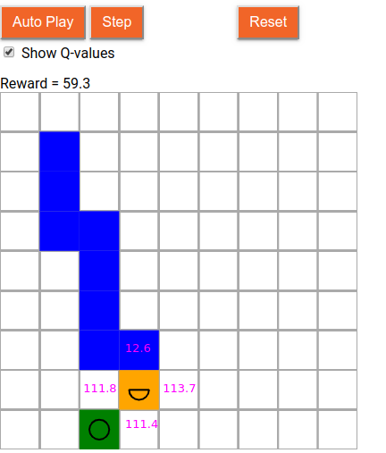

# 심층 Q-러닝을 사용해 스네이크 게임 플레이하기



[온라인 데모](https://ml-ko.kr/tfjs/snake-dqn)

심층 Q-러닝은 강화 학습 알고리즘의 하나입니다.
이 예제를 위해 사용한 스네이크 게임 같은 아케이드 스타일의 게임에 종종 사용됩니다.

## 스네이크 게임

스네이크 게임은 격자 보드 액션 게임입니다.
플레이어가 게임 보드(기본값 9x9) 위를 움직이는 가상의 스네이크를 조정합니다.
각 스텝에서 네 개의 행동이 가능합니다: 좌회전, 우회전, 위, 아래.
높은 점수(보상)을 얻기 위해 플레이어는 스네이크가 과일을 먹도록 조정하면서 다음은 피해야 합니다.
- 머리가 보드 밖으로 나갑니다.
- 헤드가 자신의 몸통에 부딪힙니다.

이 예제는 두 부분으로 구성되어 있습니다:
1. Node.js에서 심층 Q-네트워크 훈련하기
2. 브라우저에서 데모 실행하기

## Node.js에서 심층 Q-네트워크 훈련하기

다음 명령을 사용해 DQN을 훈련합니다:

```sh
yarn
yarn train
```

컴퓨터에 CUDA 지원 GPU가 있고 필요한 드라이버와 라이브러리가 설치되어 있다면 위 명령에 `--gpu` 플래그를
추가하여 GPU를 사용해 훈련할 수 있습니다. 이렇게 하면 훈련 속도를 크게 높일 수 있습니다:

```sh
yarn train --gpu
```

텐서보드로 훈련 과정을 모니터링하려면 `--logDir` 플래그를 사용하고 로그 디렉토리를 지정하세요:

```sh
yarn train --logDir /tmp/snake_logs
```

훈련 도중 텐서보드를 사용해 다음 그래프를 볼 수 있습니다:
- 게임에서 얻은 누적 보상
- 훈련 속도 (초당 게임 프레임수)
- 입실론 그리디 알고리즘의 입실론 값
등등

별도의 터미널을 열고 텐서보드를 설치한 다음 텐서보드 서버를 실행하세요:

```sh
pip install tensorboard
tensorboard --logdir /tmp/snake_logs
```

자세한 텐서보드 훈련 로그는
[TensorBoard.dev](https://tensorboard.dev/experiment/TJFBWBx3T5WrFBs4Ar76Sw/#scalars)에서 볼 수 있습니다.

텐서보드가 실행되면 콘솔에 `http://`로 시작하는 URL을 출력합니다.
브라우저를 열고 이 주소에 접속하면 로그를 확인할 수 있습니다.

## 브라우저에서 데모 실행하기

DQN 훈련이 완료된 후 다음 명령을 사용해 브라우저에서 데모를 실행하여 네트워크가 게임을
어떻게 플레이하는지 볼 수 있습니다:

```sh
npx http-server
```
